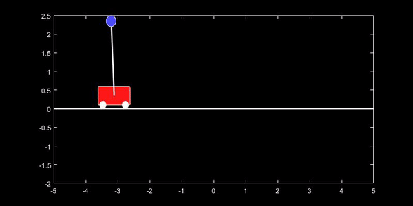

# Linear-Quadratic-Gaussian-Control-Inverted-Pendulum-On-A-Cart

**To stabilize the full nonlinear system of an Inverted Pendulum on a Cart using combination of [Kalman Filter](https://en.wikipedia.org/wiki/Kalman_filter) and LQR controller** 

#### Objectives Achieved: 

- Modeled MIMO dynamic systems using state-space techniques.
- Numerically Linearized the full nonlinear system.
- Analyzed the open-loop and closed-loop stability of any state-space representation.
- Designed linear state-feedback controller using pole placement techniques.
- Designed optimal linear state-feedback controllers using Linear Quadratic Regulator (LQR) technique.
- Designed Kalman Filter, which is an optimal full-state estimator, given Gaussian white noise disturbances and measurement noise.
- Combined the optimal full-state feedback LQR with the optimal full-state estimator (LQE or Kalman Filter) to obtain the sensor-based linear quadratic Gaussian (LQG) controller.

  

#### Languages Used:
- Matlab
- Latex 

#### Use of each file:
- [**Linear_Quadratic_Gaussian_InvertedPendulum.mlx**](Linear_Quadratic_Gaussian_InvertedPendulum.mlx) - Executable file with clearly defined problem statement and approach
- **Linear_Quadratic_Gaussian_InvertedPendulum.pdf** - Published Document for a quick check of Solutions and Code
- [**lqg_cartpend_sim.slx**](lqg_cartpend_sim.slx) - Simulink Model for Lqg controller
- [**cartpend.m**](cartpend.m) - Gives you the linearized equations of motion using Lagrange's equations
- [**drawcartpend_bw.m**](drawcartpend_bw.m) - Animation for Easy visual check of the pendulum on the cart when we feed in the data for simulation
